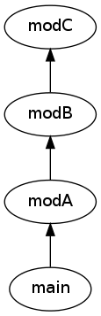

# amd-compiler [](https://travis-ci.org/amitayh/amd-compiler)

Compiles JS source written as AMD modules to a single file without the need for a loader (RequireJS / almond / etc.)

## Installation

```
$ git clone https://github.com/amitayh/amd-compiler.git
$ cd amd-compiler
$ npm install
```

## Usage

Invoke the `bin/compile` script to compile source:

```
$ node bin/compile <path/to/main> >> compiled.js
```

### Example

Say the given modules are defined in the path `/foo/bar`:


```js
// modA.js
define(["modB", "modC"], function(b, c) {
  return b + c("A");
});
```

```js
// modB.js
define(["modC"], function(c) {
  return c("B");
});
```

```js
// modC.js
define(function() {
  return function(name) {
    return "Hello, " + name + "!";
  };
});
```

```js
// main.js
require(["modA", "modB"], function(a, b) {
  console.log(a, b);
});
```

Then invoking the comiler script like so:

```
$ node bin/compile /foo/bar/main
```

Will generate the following output:

```js
(function () {
  // Source: /foo/bar/modC.js
  var modC = function () {
      return function (name) {
        return "Hello, " + name + "!";
      };
    }();
  // Source: /foo/bar/modB.js
  var modB = function (c) {
      return c("B");
    }(modC);
  // Source: /foo/bar/modA.js
  var modA = function (b, c) {
      return b + c("A");
    }(modB, modC);
  // Source: /foo/bar/main.js
  (function (a, b) {
    console.log(a, b);
  }(modA, modB));
}());
```

## Running tests

Install [mocha](http://visionmedia.github.io/mocha/):

```
$ npm install -g mocha
```

Run tests:

```
$ mocha specs/
```

## Internals

1. Dependency graph is resolved, using [esprima](http://esprima.org/) for parsing the JS sources:<br>
   
2. Graph is topologically sorted, making sure that the dependencies are in the correct order:<br>
   
3. Using [escodegen](https://github.com/Constellation/escodegen), the compiler constructs a single source from all needed dependencies